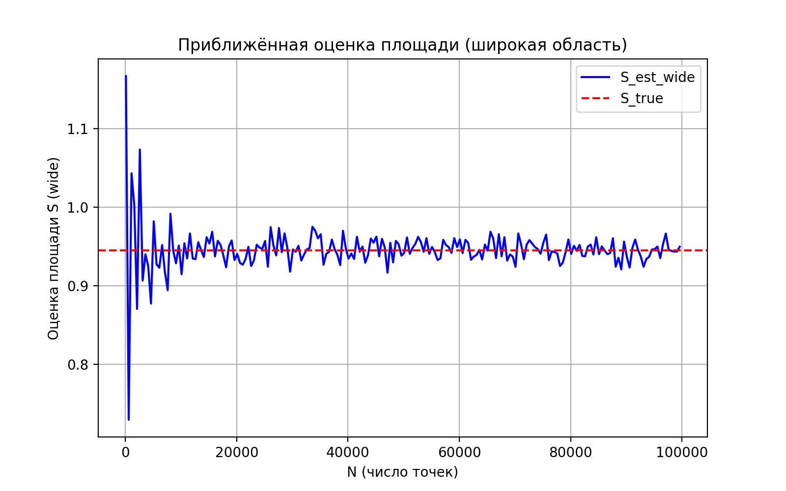
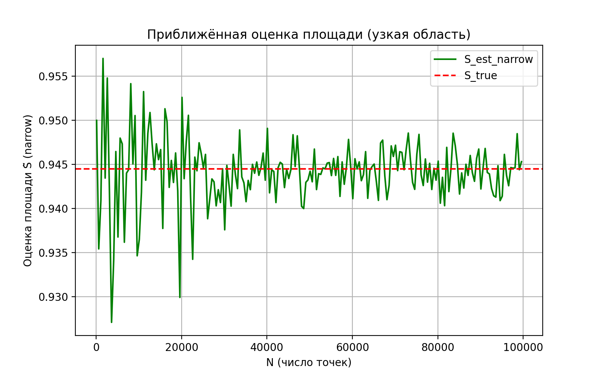
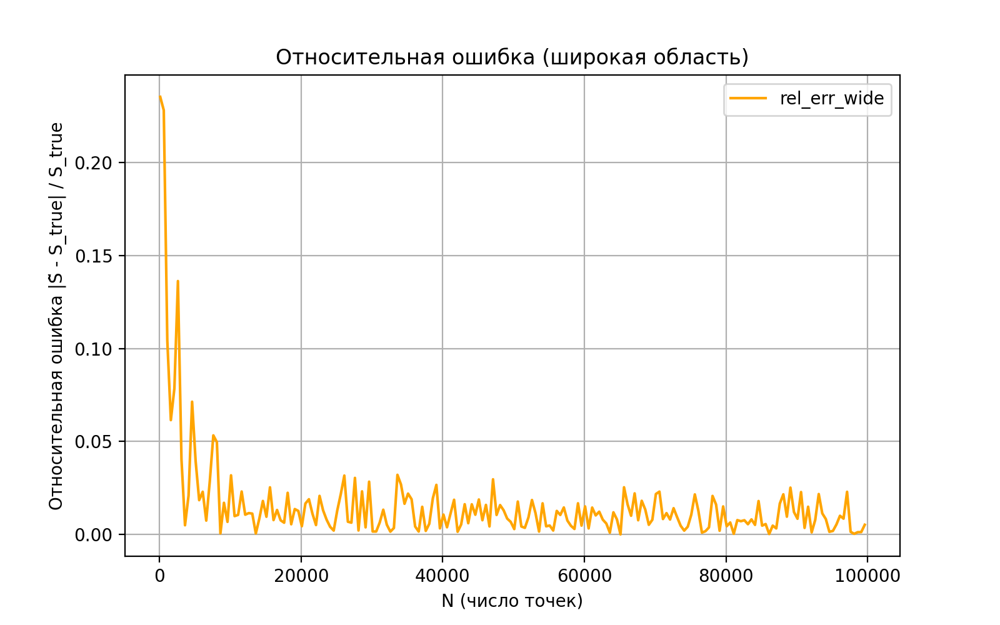
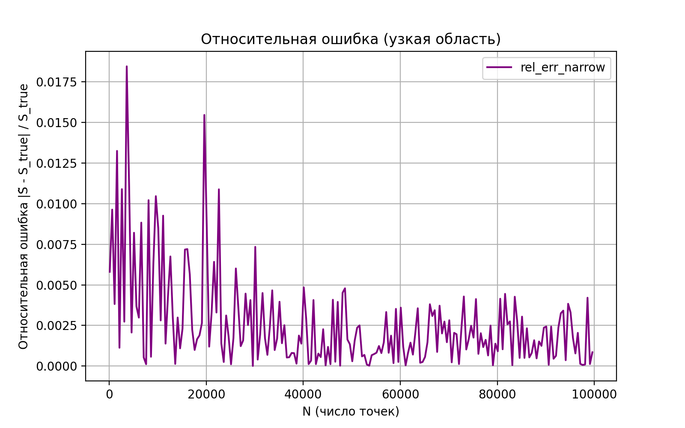

# Оценка площади пересечения трёх кругов методом Монте-Карло

## Репозиторий

https://github.com/M0s1ck/algorithms-and-data-structures

## Математическая основа

Точное значение площади пересечения вычисляется аналитически как:

$$
S_{true} = 0.25 \cdot \pi + 1.25 \cdot \arcsin(0.8) - 1
$$

## Метод Монте-Карло

Площадь пересечения трёх кругов оценивается как:

$$
\tilde{S} = \frac{M}{N} \cdot S_{rect},
$$

где:
- `N` — количество случайных точек, равномерно распределённых в прямоугольной области;
- `M` — количество точек, попавших в пересечение трёх кругов;
- `S_rect` — площадь прямоугольной области генерации точек.

Использовались две стратегии выбора прямоугольника:
- **wide** — широкая область, полностью охватывающая все три круга;
- **narrow** — минимально возможная область, точно покрывающая пересечение кругов.

---

## Реализация

Решение состоит из нескольких файлов:

### `a1i.cpp`
Реализация базового алгоритма Монте-Карло для Codeforces-задачи A1i<br>
Номер посылки: ``348457572``

### `monte_carlo.cpp`
Основной экспериментальный модуль.  
Для каждой стратегии (`wide`, `narrow`) вычисляет приближённую площадь при разных `N` от `100` до `100000` с шагом `500`.  
Результаты сохраняются в файл `data.csv` со следующими колонками:

| N | S_est_wide | rel_err_wide | S_est_narrow | rel_err_narrow |
|---|-------------|---------------|---------------|----------------|

где  
$$
rel\_err = \frac{|\tilde{S} - S_{true}|}{S_{true}}
$$

## Визуализация

### `plot.py`

Скрипт на Python для построения четырёх графиков по данным из data.csv<br>
Скрипт создаёт четыре PNG-файла:

### Приближённая площадь (широкая область)


### Приближённая площадь (узкая область)


### Относительная ошибка (широкая область)


### Относительная ошибка (узкая область)



## Анализы графиков 

По результатам эксперимента:
- Узкая область (narrow) дала меньшие относительные ошибки и быстрее сходилась к точному значению
- Широкая область (wide) показала более значительные флуктуации что большая часть случайных точек не попадала в пересечение
- Таким образом, результаты соответствуют теоретическим ожиданиям:
```чем плотнее область генерации охватывает исследуемую фигуру, тем выше эффективность и точность метода Монте-Карло при том же количестве точек```

## Выводы
1. Метод Монте-Карло корректно оценивает площадь пересечения трёх кругов.
2. Точность результата возрастает при увеличении числа сгенерированных точек N.
3. Использование узкой области генерации (narrow) повышает эффективность метода,
так как уменьшает долю «пустых» точек и снижает дисперсию оценки.
