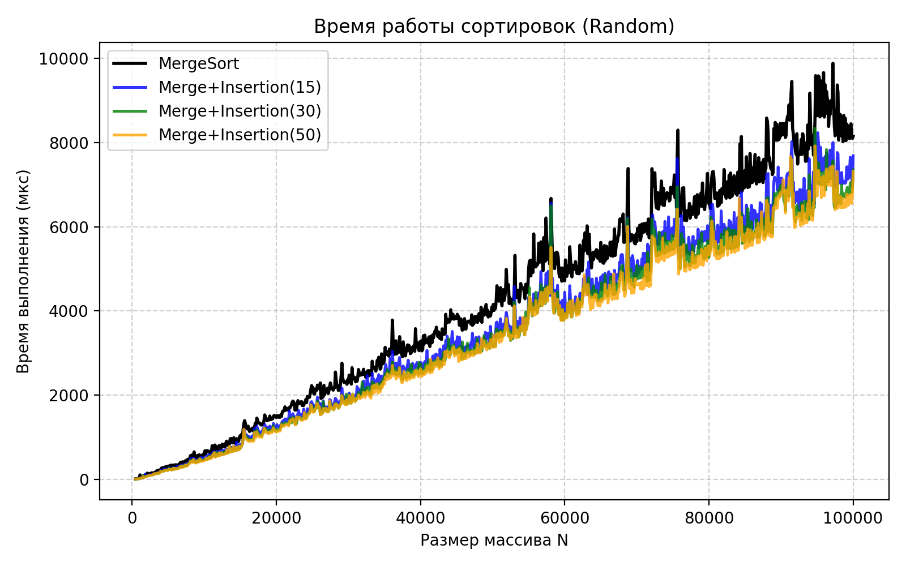
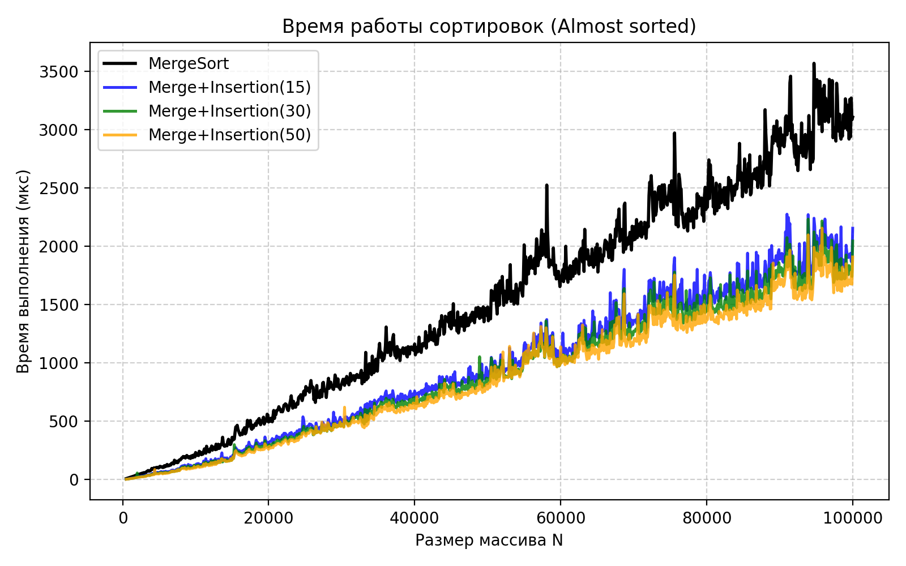
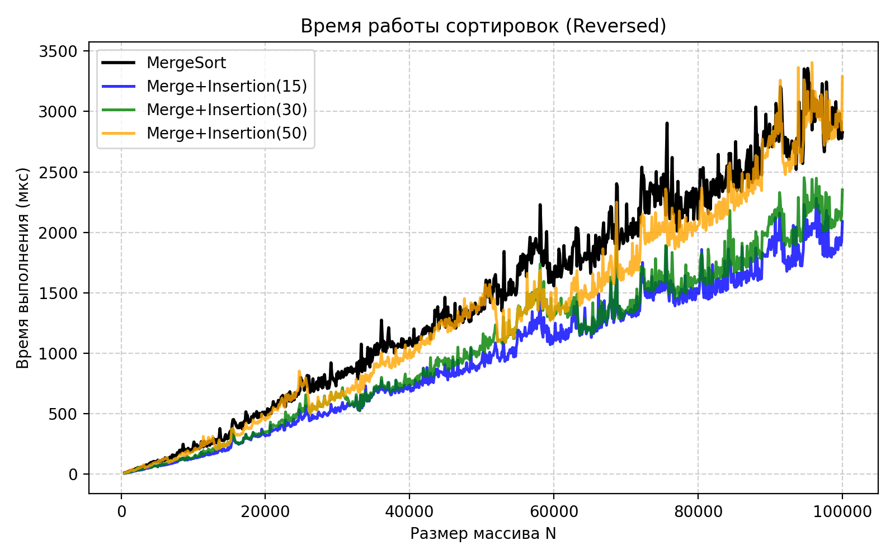

# A2 - Анализ MergeSort и гибридного Merge+Insertion

## Репозиторий
https://github.com/M0s1ck/algorithms-and-data-structures

## Алгоритм на CodeForces

Файл: `a2i.cpp`<br>
Посылка: `348598628`

## Описание
Проведено сравнение классического **MergeSort** и гибридного **Merge+InsertionSort**, где для малых подмассивов используется InsertionSort<br>
Эксперименты выполнены для трёх типов входных данных:
- `random` - случайные элементы [0, 10000]
- `reversed` - обратно отсортированные
- `almost_sorted` - почти отсортированные

## Параметры эксперимента
- Размеры массивов `N` от 500 до 100000, шаг 100  
- `threshold ∈ {15, 30, 50}`  
- `repeats = 20` измерений  
- Время - **микросекунды (µs)**  
- Для устойчивости - медиана 20 прогонов 
- Генерация массивов - класс `ArrayGenerator`  
- Замеры - класс `SortTester`

Результаты сохраняются в **data.csv**:
```
N,merge_rand,merge_insertion_15_rand,merge_insertion_30_rand,merge_insertion_50_rand,merge_reversed,merge_insertion_15_reversed,merge_insertion_30_reversed,merge_insertion_50_reversed,merge_almost_sorted,merge_insertion_15_almost_sorted,merge_insertion_30_almost_sorted,merge_insertion_50_almost_sorted
```

## Графики
Для каждой категории построен отдельный график (`plot.py`)<br>
На каждом - 4 линии: Merge и гибриды с тремя threshold








## Результаты

### Random
- Все гибриды быстрее MergeSort 
- У бóльших threshold результаты лучше
- Оптимум около **30-50**

### Almost Sorted
- Гибриды существенно быстрее MergeSort
- Чем выше threshold - тем быстрее (Insertion эффективен на почти отсортированных данных)
- Оптимум **50**

### Reversed
- При threshold=15,30 гибрид быстрее Merge
- При больших threshold (50) возможна деградация - Insertion в худшем случае \(O(n^2)\)
- Оптимум **15**

## Выводы
1. **Гибрид Merge+Insertion** почти всегда быстрее чистого MergeSort
2. Оптимальный порог зависит от данных:
   - Random → 30–40  
   - Almost sorted → 40–60  
   - Reversed → ≤15  
3. Универсальное значение: **threshold ≈ 20–30**
4. Аномальные пики на графиках - следствие системных задержек

## Файлы проекта
- `array_generator.cpp` - генерация тестовых массивов  
- `sorts.cpp` - MergeSort и Merge+InsertionSort  
- `sort_tester.cpp` - тестирование и замеры  
- `main.cpp` - точка входа  
- `data.csv`, `plot.py` - результаты и визуализация  
- `plot_random.png`, `plot_reversed.png`, `plot_almost_sorted.png` - графики