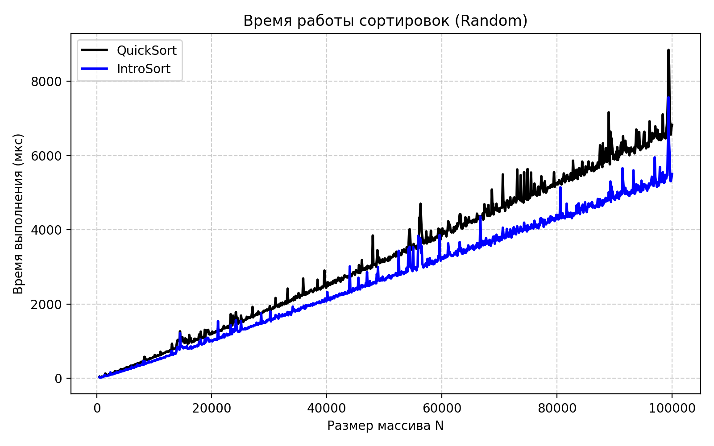
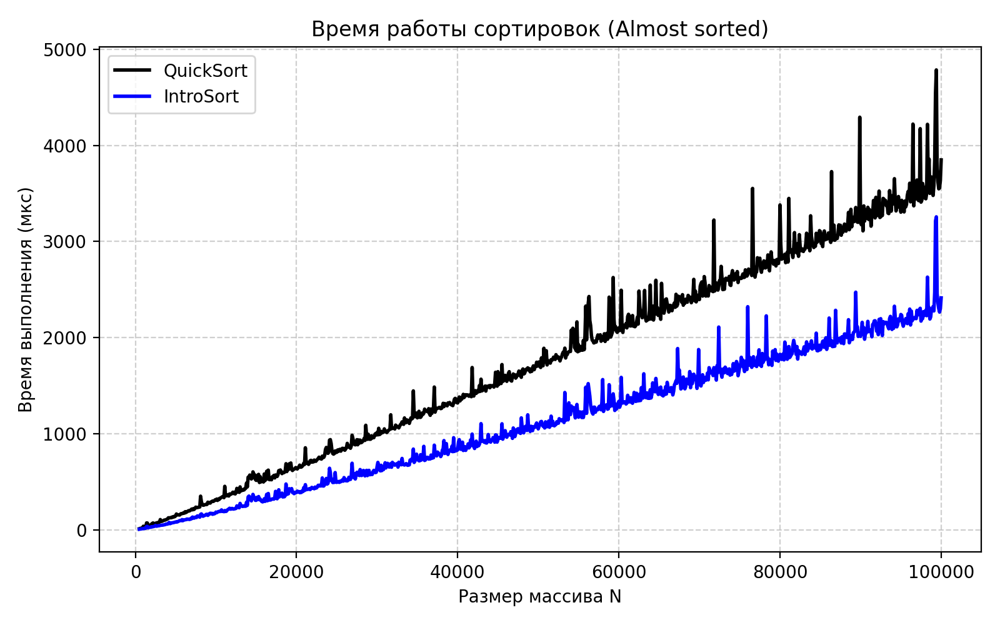
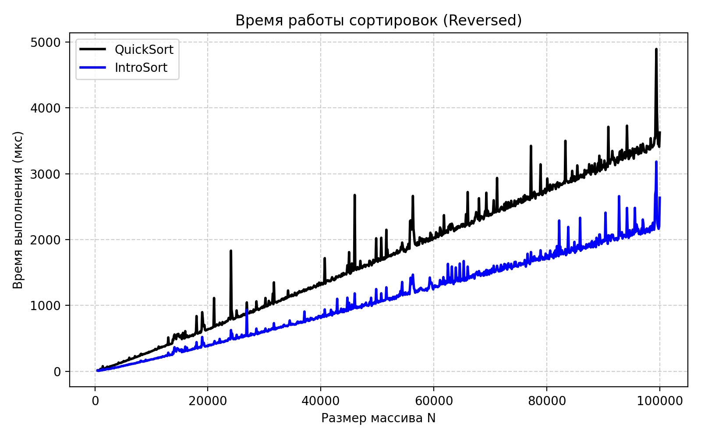

# A3 — Анализ QuickSort и гибридного IntroSort

## Репозиторий
https://github.com/M0s1ck/algorithms-and-data-structures

## Алгоритм на CodeForces

Файл: `a3i.cpp`<br>
Посылка: `349028443`

## Описание
Сравнивались
- **QuickSort** — быстрая сортировка с рандомизированным выбором опорного элемента
- **IntroSort** — быстрая сортировка + heapsort при глубине рекурсии > log2 N + insertion sort на малых массивах (< 16)

Эксперименты выполнены для трёх типов входных данных:
- `random` - случайные элементы [0, 10000]
- `reversed` - обратно отсортированные
- `almost_sorted` - почти отсортированные

## Параметры эксперимента
- Размеры массивов `N` от 500 до 100000, шаг 100 
- `repeats = 20` измерений  
- Время - **микросекунды (µs)**  
- Для устойчивости - медиана 20 прогонов 
- Генерация массивов - класс `ArrayGenerator`  
- Замеры - класс `SortTester`

Результаты сохраняются в **data.csv**:
```N,quick_rand,intro_rand,quick_reversed,intro_reversed,quick_almost,intro_almost```

## Графики
Для каждой категории построен отдельный график (`plot.py`)<br>








## Результаты и анализ

### Random
- На случайных данных оба алгоритма работают медленнее двух других кейсов.
- IntroSort consistently быстрее QuickSort, но разрыв умеренный.
- Причина: QuickSort на случайных данных работает стабильно благодаря рандомизации, поэтому его слабые стороны проявляются меньше; IntroSort всё же выигрывает за счёт раннего перехода на Insertion Sort и контроля глубины рекурсии.

### Reversed
- Оба алгоритма сортируют обратные массивы намного быстрее, чем случайные - рандомизированный выбор опорного элемента предотвращает худший случай.
- Здесь IntroSort выигрывает у QuickSort заметно сильнее.
- Причина: QuickSort может получать неудачные последовательности разбиений, тогда как IntroSort «страхует» себя HeapSort’ом при глубокой рекурсии.

### Almost Sorted
- Лучший кейс для обеих сортировок: времена минимальны.
- IntroSort даёт самый большой выигрыш - разрыв с QuickSort сравним с reversed.
- QuickSort использует рандомизированные разбиения и не может эффективно использовать структуру почти отсортированных данных
- Insertion Sort внутри IntroSort работает почти идеально

## Выводы

- **Оба алгоритма заметно быстрее на почти отсортированных и обратных массивах**, чем на случайных.  
  Это связано с тем, что рандомизированные разбиения позволяют избежать худших сценариев, а структура данных часто упрощает сортировку.
- **IntroSort стабильно превосходит QuickSort на всех типах входов.**
- **На случайных данных разрыв между ними минимальный**, QuickSort там работает наиболее предсказуемо.
- **На Reversed и Almost-sorted массивах разрыв значительно сильнее**, и в обоих случаях:
  - QuickSort всё ещё зависит от качества разбиений,
  - IntroSort более надёжен и эффективно использует Insertion Sort на малых подмассивах.
- Таким образом, полученные результаты подтверждают:
  - устойчивость,
  - предсказуемость,
  - и высокую эффективность IntroSort по сравнению с классическим QuickSort,

---

## Файлы проекта
- `array_generator.cpp` - генерация тестовых массивов  
- `sorts.cpp` - QuickSort и IntroSort  
- `sort_tester.cpp` - тестирование и замеры  
- `main.cpp` - точка входа
- `data.csv`, `plot.py` - результаты и визуализация  
- `plot_random.png`, `plot_reversed.png`, `plot_almost_sorted.png` - графики